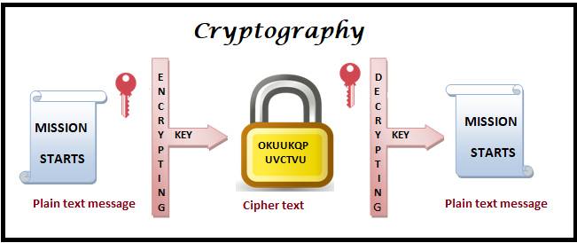
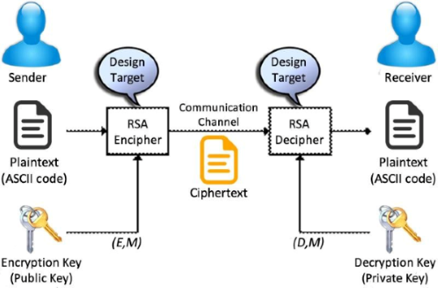

# Theory

Cryptography is the study and practice of techniques for secure communication in the presence of third parties called adversaries. It deals with developing and analyzing protocols which prevents malicious third parties from retrieving information being shared between two entities thereby following the various aspects of information security.

#### Cryptography Components

1. **Plaintext and Ciphertext**

   The original message, before being transformed, is called plaintext. After the message is transformed, it is called ciphertext. An encryption algorithm transforms the plaintext into ciphertext; a decryption algorithm transforms the ciphertext back into plaintext.

   <center></center>

2. **Cipher**

   In cryptography, a cipher (or cypher) is an algorithm for performing encryption or decryption—a series of well-defined steps that can be followed as a procedure.

   <center> </center>

3. **Key**

   A key is a number (or a set of numbers) that the cipher, as an algorithm, operates on.

  <center> </center>

#### Categories of Cryptography

1. **Symmetric key (also called secret-key) cryptography algorithms**

   In symmetric-key cryptography, the same key is used by both parties. The sender uses this key and an encryption algorithm to encrypt data; the receiver uses the same key and the corresponding decryption algorithm to decrypt the data. In symmetric-key cryptography, the same key is used by the sender (for encryption) and the receiver (for decryption).

   Examples:
   - XOR Cipher
   - Data Encryption Standard (DES)
   - Advanced Encryption Standard (AES)

   <center></center>

   1. **XOR**

      XOR (an acronym for exclusive or) is a function of two bits that produces 1 bit. The function applied is essentially additional modulo 2, i.e. x + y % 2.

      This produces the following output table:

      | X | Y | X XOR Y |
      |---|---|---------|
      | 0 | 0 | 0       |
      | 0 | 1 | 1       |
      | 1 | 0 | 1       |
      | 1 | 1 | 0       |

      **Repeating Key XOR Cipher**

      Suppose we have some text: The secret is 42, as well as a key: cold. We can encipher the text using the key by applying the XOR function between the characters in the key and the text, i.e.

      `ciphertext = key ^ text`

      To compensate for the text being longer than the key, we can repeat the key multiple times so that things line up nicely.

      ```
      The secret is 42  
      coldcoldcoldcold  
      ```

      This repeating technique is the reason why this is called a repeating key cipher. Deciphering the text can be done by applying the XOR function between the enciphered text and the key.

2. **Asymmetric (also called public-key) cryptography algorithms**

   In asymmetric or public-key cryptography, there are two keys: a private key and a public key. The private key is kept by the receiver. The public key is announced to the public.

   Examples:
   - RSA
   - Diffie-Hellman

   <center></center>

   #### RSA ALGORITHM

   The most common public key algorithm is RSA, named for its inventors Rivest, Shamir, and Adleman (RSA). It uses two numbers, e and d, as the public and private keys.

   In RSA, e and n are announced to the public; d and Φ (PHI) are kept secret. Steps to select the private and public keys:

   1. Bob chooses two very large prime numbers p and q.
   2. Bob multiplies the above two primes to find n, the modulus for encryption and decryption. n = p × q.
   3. Bob calculates another number Փ = (p - 1) × (q - 1).
   4. Bob chooses a random integer e. He then calculates d so that d × e = 1 mod Փ.
   5. Bob announces e and n to the public; he keeps Փ and d secret.

   #### Encryption

   Anyone who needs to send a message to Bob can use n and e. For example, if Alice needs to send a message to Bob, she can change the message, usually a short one, to an integer. This is the plaintext. She then calculates the ciphertext, using e and n.

   `C = P^e ( mod n )`

   Alice sends C, the ciphertext, to Bob.

   #### Decryption

   Bob keeps Փ and d private. When he receives the ciphertext, he uses his private key d to decrypt the message:

   `P = C^d ( mod n )`

   #### Restriction

   For RSA to work, the value of P must be less than the value of n. If P is a large number, the plaintext needs to be divided into blocks to make P less than n.

   <center></center>

   #### Advantages of RSA

   - It is very easy to implement RSA algorithm.
   - RSA algorithm is safe and secure for transmitting confidential data.
   - Cracking RSA algorithm is very difficult as it involves complex mathematics.
   - Sharing public key to users is easy.

   #### Disadvantages of RSA

   - It may fail sometimes because for complete encryption both symmetric and asymmetric encryption is required and RSA uses asymmetric encryption only.
   - It has slow data transfer rate due to large numbers involved.
   - It requires third party to verify the reliability of public keys sometimes.
   - High processing is required at receiver’s end for decryption.
   - RSA can’t be used for public data encryption like election voting.
